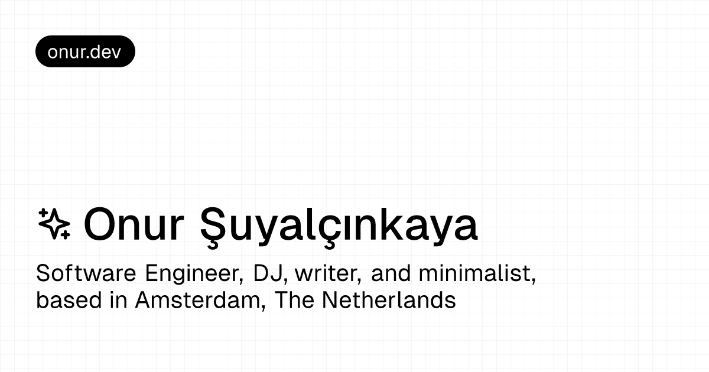

# Ryan Alexander Zhang



<br>
<br>

This repository contains my personal website. It is built with `Next.js`, `Tailwind CSS`, `Contentful`, and a few small
integrations for bookmarks, analytics, and profile data. The home page intro and sidebar profile now read directly from
my GitHub profile and profile `README`, so updating GitHub is enough to refresh that content.

## Overview

- `/` — Home page.
- `/[slug]` — Static pre-rendered pages using [Contentful](https://www.contentful.com). (e.g. `/stack`)
- `/writing` — Writing page.
- `/writing/[slug]` — Static pre-rendered writing pages using [Contentful](https://www.contentful.com).
- `/cards` — Permanent-note boxes by tag, with random draws and outgoing-link exploration.
- `/cards/[noteId]` — Permanent note in Chinese or English, with related cards by link distance.
- `/journey` — Journey page.
- `/bookmarks` — Bookmarks page.
- `/bookmarks/[slug]` — Static pre-rendered bookmarks pages using [Raindrop](https://raindrop.io/).
- `/bookmarks.xml` — Bookmarks XML feed.
- `/api` — API routes.

## Running Locally

```bash
$ git clone <your-repository-url>
$ cd <repo-directory>
$ bun i
$ bun dev
```

Create a `.env` file based on [`.env.example`](./.env.example).

If Vercel hits GitHub API rate limits during build, set `GITHUB_TOKEN` in the project environment variables. The site
can fall back without it, but authenticated requests are more reliable for profile metadata during prerendering.

To enable page view tracking, apply the SQL in
[`supabase/migrations/20260613195000_page_views.sql`](./supabase/migrations/20260613195000_page_views.sql) to your
Supabase project. This creates the `public.pages` table, exposes read access for the browser client, registers the table
for Realtime, and installs the `increment_view_count(page_slug)` RPC used by the Next.js API route.

Tinybird analytics resources now live under [`tinybird/`](./tinybird). The runtime site still uses `flock.js`, but the
datasource, tokens, and query endpoints are defined in-repo. See
[docs/tinybird-integration.md](./docs/tinybird-integration.md).

## Permanent Notes

Cards read published `permanentNote` entries from Contentful; development also uses published entries by default.
Chinese and English content share one canonical `noteId` and URL. Configure `CONTENTFUL_ENVIRONMENT_ID` (default
`master`) and optionally `CONTENTFUL_LOCALE` (otherwise Contentful's default locale) alongside delivery credentials.
Missing credentials or an uninstalled content model produces an empty collection; service and authorization failures
surface as errors.

`/cards` opens directly into the first tag's infinite carousel. Choose a box in the left sidebar (or the mobile
selector), then use previous/next, drag, horizontal touch swipes, or scroll on the stage to browse. Side cards recenter
when clicked; Random draws uniformly from the selected box. Click the center card or its language control to flip
between Chinese and English. Its body scrolls independently, and its source button opens references.

The relationship view follows actual outgoing links from both language bodies across tags. **Level** sets the maximum
link distance; notes appear as labeled dots, deduplicated with actual directed edges. Selecting a node or a body link
returns to its card, keeping the current box if it contains the note, otherwise selecting the destination's box. Drag to
pan, scroll or pinch to zoom, **Fit** to see the whole graph, and **Focus** to center the current note. With the map
focused, arrow keys pan, `+`/`-` zoom, `F` or `0` fits, and `C` focuses. Card links retain canonical `/cards/[noteId]`
URLs; the tag/view query and browser Back preserve workspace context. Carousel movement, flips, and the map respect the
system's reduced-motion preference.

See [the Obsidian publishing guide](./scripts/obsidian/README.md) for model setup, QuickAdd installation, and
publishing. After publishing, the `permanentNote` revalidation webhook refreshes the cards collection, every
detail/graph view, and sitemap.

## Tech Stack

- [Next.js](https://nextjs.org)
- [Tailwind CSS](https://tailwindcss.com)
- [shadcn/ui](https://ui.shadcn.com)
- [Contentful](https://www.contentful.com)
- [Raindrop](https://raindrop.io)
- [Supabase](https://supabase.com)
- [Tinybird](https://tinybird.co)
- [Vercel](https://vercel.com)

## Repo Activity


## License

1. Feel free to take inspiration from this code.
2. Avoid directly copying it, please.
3. Crediting the author is appreciated.

No complicated licensing. Be kind and help others learn.

> You can use the same license with: https://github.com/superkhau/lice

```bash
$ npm install -g lice
$ lice -l personal_site
```
